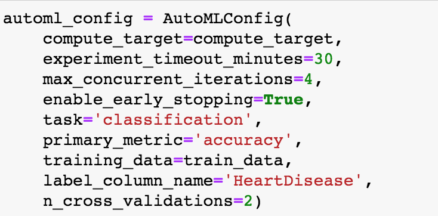

# Heart attach prediction

In my Capstone project, I use the Heart attack data from a Kaggle competition. With this dataset I have built a Hyperdrive and AutoML model. Furthermore, for the AutoML model, U have deployed the best model as a webservice. 

## Project Set Up and Installation

### Dataset task and access

The dataset describes Cardiovascular diseases (CVDs). Four out of 5CVD deaths are due to heart attacks and strokes, and one-third of these deaths occur prematurely in people under 70 years of age. Heart failure is a common event caused by CVDs and this dataset contains 11 features that can be used to predict a possible heart disease. (For more information see the description on the Kaggle page).

The heart attack data is in a csv format.  It was downloaded from the Kaggle page here: https://www.kaggle.com/datasets/fedesoriano/heart-failure-prediction. 

We have data for each of the following features: Age, Sex, ChestPainType, RestingBP, Cholesterol, FastingBS, RestingECG, MaxHR, ExerciseAngina, Oldpeak, ST_Slope. Finally, in the column HeartDisease is the value that we would like to predict. The  0 and 1 predicts whether the event was a heart attack or not.

## Automated ML
First  I have ran the Automated ML with the settings below. So the experiment will time out after 30 minutes and early stopping is enabled. Note that this is my intend to get the best model ever, because otherwise you might want to experiment with different running times. The aim is merely to generate working code for classification that will set up an autoML run. 

### Results

There are many ways in which this can be improved. First of all, one could experiment with the times that the model runs. Maybe results would be better if we run it for a longer time. One could also try to have higher number of cross validations. Personally, I am not always a fan of voting ensembles, so I would probably not use a voting ensemble, but just one of the models that are part of the voting ensemble and maybe play some more with their hyperparameter settings. 

*TODO*: What are the results you got with your automated ML model? What were the parameters of the model? How could you have improved it?

*TODO* Remeber to provide screenshots of the `RunDetails` widget as well as a screenshot of the best model trained with it's parameters.

## Hyperparameter Tuning

For the hyperparameter tuning, I have used the RBF Support Vector Machine (the SVC model). See https://scikit-learn.org/stable/auto_examples/classification/plot_classifier_comparison.html. SKlearn has several options to do classification. And I just wanted to try out the SVM for once. This SVC model has two parameters, namely a regularization parameter C and the gamma. 

I used the following set of variables to run the model. In total I had runs, where C is .... and gamma is .... .

Note that before handing the data to the SVM model, we have performed one hot encoding.

### Results
*TODO*: What are the results you got with your model? What were the parameters of the model? 

These experiments can easily be improved. For starters, the range for which I run the model can be made much larger, with more values. But this was beyond the scope of this project. Furthermore, maybe one could perform scaling and maybe some more cleaning methods. Also it would make sense to try out different models like for instance Random Forest or other models.

*TODO* Remeber to provide screenshots of the `RunDetails` widget as well as a screenshot of the best model trained with it's parameters.

## Model Deployment
*TODO*: Give an overview of the deployed model and instructions on how to query the endpoint with a sample input.

## Screen Recording
*TODO* Provide a link to a screen recording of the project in action. Remember that the screencast should demonstrate:
- A working model
- Demo of the deployed  model
- Demo of a sample request sent to the endpoint and its response

## Standout Suggestions
*TODO (Optional):* This is where you can provide information about any standout suggestions that you have attempted.
